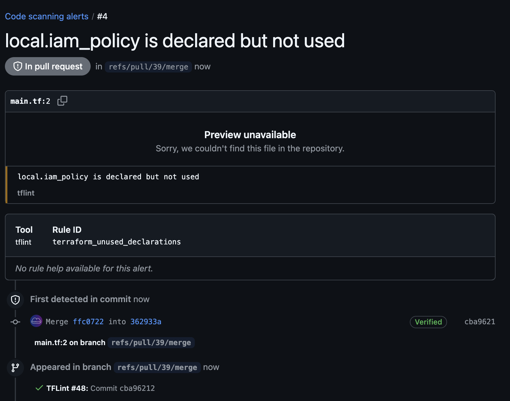

# github-action-tfsec-upload [](https://github.com/The-Infra-Company/github-action-tfsec-upload/releases/latest)

A GitHub Action to run tfsec and post the results to the GitHub Security tab.



## Usage

```yaml
name: tfsec

on:
  pull_request:
    branches: [ 'main' ]
    types: [ opened, synchronize, reopened, closed, labeled, unlabeled ]

jobs:
  terraform:
    runs-on: ubuntu-latest
    steps:
      - name: Clone repo
        uses: actions/checkout@v4

      - name: Setup Terraform
        uses: hashicorp/setup-terraform@v3

      - name: Terraform Init
        run: terraform init
        working-directory: "terraform/modules/vpc"

      - name: Run tfsec
        uses: The-Infra-Company/github-action-tfsec-upload@v0.1.0
        with:
          github_token: ${{ secrets.GITHUB_TOKEN }}
          working_directory: "terraform/modules/vpc"
          tfsec_flags: "--exclude aws-iam-no-policy-wildcards"
```

<!-- action-docs-inputs source="action.yml" -->
## Inputs

| name | description | required | default |
| --- | --- | --- | --- |
| `github_token` | <p>GITHUB_TOKEN</p> | `true` | `${{ github.token }}` |
| `working_directory` | <p>Directory to run the action on, from the repo root. Default is . (root of the repository)</p> | `false` | `.` |
| `tfsec_version` | <p>The tfsec version to install and use. Default is to use the latest release version.</p> | `false` | `latest` |
| `tfsec_rulesets` | <p>Space separated, official (from the terraform-linters GitHub organization) tfsec rulesets to install and use. If a pre-configured <code>TFLINT_PLUGIN_DIR</code> is set, rulesets are installed in that directory. Default is empty.</p> | `false` | `""` |
| `tfsec_init` | <p>Whether or not to run tfsec --init prior to running scan [true,false] Default is <code>false</code>.</p> | `false` | `false` |
| `tfsec_target_dir` | <p>The target dir for the tfsec command. This is the directory passed to tfsec as opposed to working_directory which is the directory the command is executed from. Default is . (root of the repository)</p> | `false` | `.` |
| `tfsec_config` | <p>Config file name for tfsec. Default is <code>.tfsec.hcl</code>.</p> | `false` | `.tfsec.hcl` |
| `flags` | <p>List of arguments to send to tfsec For the output to be parsable by reviewdog --format=checkstyle is enforced Default is --call-module-type=all.</p> | `false` | `--call-module-type=all` |
<!-- action-docs-inputs source="action.yml" -->

<!-- action-docs-outputs source="action.yml" -->
## Outputs

| name | description |
| --- | --- |
| `tfsec-return-code` | <p>tfsec command return code</p> |
<!-- action-docs-outputs source="action.yml" -->
