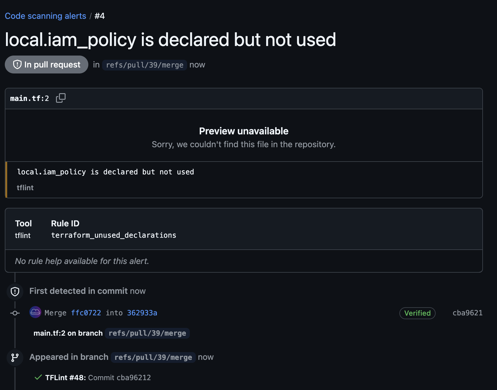

# github-action-trivy-upload [](https://github.com/The-Infra-Company/github-action-trivy-upload/releases/latest)

A GitHub Action to run Trivy and post the results to the GitHub Security tab.



## Usage

```yaml
name: trivy

on:
  pull_request:
    branches: [ 'main' ]
    types: [ opened, synchronize, reopened, closed, labeled, unlabeled ]

jobs:
  terraform:
    runs-on: ubuntu-latest
    steps:
      - name: Clone repo
        uses: actions/checkout@v4

      - name: Setup Terraform
        uses: hashicorp/setup-terraform@v3

      - name: Terraform Init
        run: terraform init
        working-directory: "terraform/modules/vpc"

      - name: Run trivy
        uses: The-Infra-Company/github-action-trivy-upload@v0.1.0
        with:
          github_token: ${{ secrets.GITHUB_TOKEN }}
          working_directory: "terraform/modules/vpc"
          trivy_flags: "--exclude aws-iam-no-policy-wildcards"
```

<!-- action-docs-inputs source="action.yml" -->
## Inputs

| name | description | required | default |
| --- | --- | --- | --- |
| `github_token` | <p>GITHUB_TOKEN</p> | `true` | `${{ github.token }}` |
| `working_directory` | <p>Directory to run the action on, from the repo root. Default is . (root of the repository)</p> | `false` | `.` |
| `trivy_command` | <p>Trivy command [aws,config,filesystem,image,kubernetes,rootfs,sbom,vm]</p> | `true` | `""` |
| `trivy_target` | <p>Trivy target to scan</p> | `true` | `""` |
| `trivy_version` | <p>The version of trivy to install. Default is latest.</p> | `false` | `latest` |
| `trivy_flags` | <p>List of arguments to send to trivy For the output to be parsable by reviewdog --format=checkstyle is enforced Default is blank.</p> | `false` | `""` |
<!-- action-docs-inputs source="action.yml" -->

<!-- action-docs-outputs source="action.yml" -->
## Outputs

| name | description |
| --- | --- |
| `trivy-return-code` | <p>trivy command return code</p> |
<!-- action-docs-outputs source="action.yml" -->
